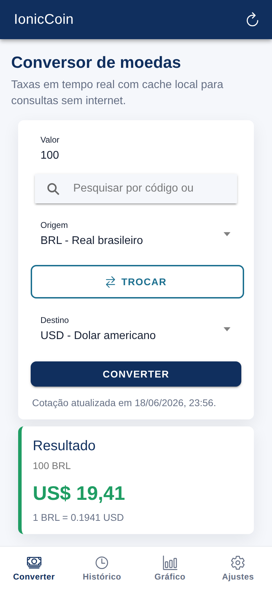
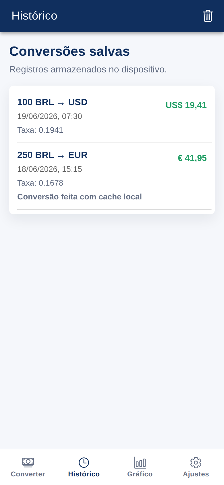
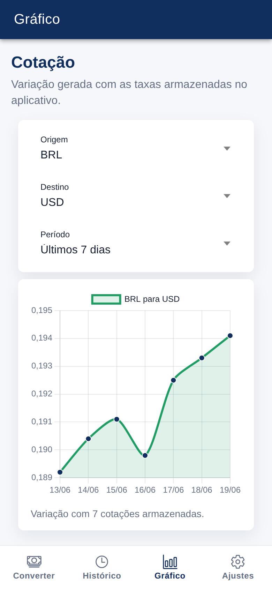
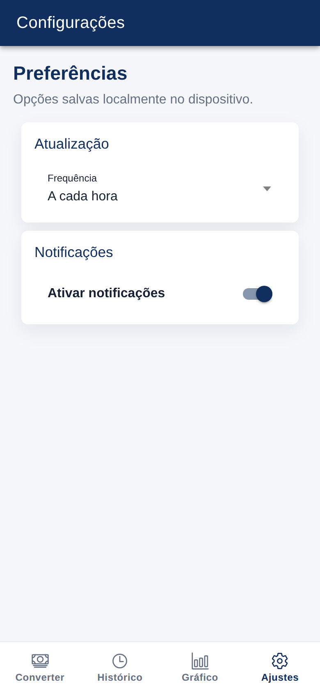

# IonicCoin

IonicCoin é um aplicativo mobile feito com Ionic e Angular para conversão de moedas usando uma API REST pública de câmbio. O app consulta taxas atualizadas, salva as últimas cotações no navegador e continua funcionando com cache local quando não há internet.

## Funcionalidades

- Conversão entre moedas internacionais.
- Lista de moedas com busca por código ou nome.
- Troca rápida entre moeda de origem e destino.
- Atualização das taxas ao abrir o app e ao converter.
- Histórico de conversões salvo em LocalStorage.
- Modo offline usando as últimas taxas armazenadas.
- Gráfico de cotações com Chart.js.
- Configuração de frequência de atualização.
- Opção local para ativar ou desativar notificações.
- Mensagens de loading, sucesso, erro e confirmação.

## Tecnologias

- Ionic Framework
- Angular
- TypeScript
- Angular HttpClient
- RxJS
- SCSS
- Capacitor
- LocalStorage
- REST API
- Chart.js

## Como executar

Instale as dependências:

```bash
npm install
```

Execute o projeto:

```bash
ionic serve
```

Também é possível iniciar pelo script do npm:

```bash
npm run start
```

## Estrutura do Projeto

- `src/app/pages/converter`: tela principal de conversão.
- `src/app/pages/history`: histórico das conversões feitas.
- `src/app/pages/chart`: gráfico com cotações armazenadas.
- `src/app/pages/settings`: preferências do usuário.
- `src/app/services`: comunicação com API, cache e LocalStorage.
- `src/app/models`: interfaces usadas no projeto.
- `src/theme`: variáveis de tema do Ionic.

## Capturas de Tela

### Conversão



### Histórico



### Gráfico



### Configurações



## Licença

Este projeto está licenciado sob a licença MIT.
